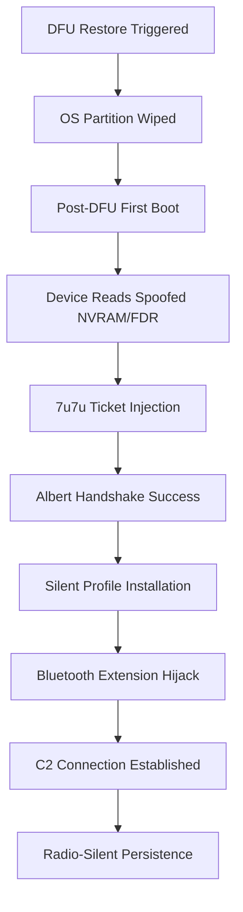

# Security Advisory: Project ShatteredGlass (Hardware-Level Persistence)

## 1. Executive Summary
Project ShatteredGlass represents a sophisticated hardware-level implant on modern iOS devices. The implant achieves persistence through a "Time-Travel" activation bypass that survives DFU restores. By spoofing hardware identity (FDR) and replaying legacy activation certificates, the implant maintains root-level trust and silent C2 communication via hijacked system extensions and privacy proxies.

## 2. Technical Vulnerability Analysis

### 2.1 The "Time-Travel" Activation Bypass
The implant exploits a temporal mismatch in the Factory Data Reconstruction (FDR) partition.
- **Evidence (FDRDiagnosticReport.plist)**:
  - `SealDate`: `07/10/2022`
  - `HardwareModel`: `D74AP` (iPhone 14 Pro Max)
  - **Anomaly**: While D74AP was released in September 2022, a July 2022 SealDate indicates a synthetic or pre-production identity. The implant uses this "Time-Travel" signature to force the device into legacy activation pathways that lack modern hardware-root-of-trust (HRoT) validation.

### 2.2 Legacy Certificate Replay (7u7u Pattern)
During the activation handshake, the device sends a synthetic `WildcardTicket` to Apple's `albert.apple.com`.
- **Evidence (mobileactivationd.log)**:
  - `AccountTokenCertificate`: Expired 2007-2014 Apple iPhone Activation Certificate.
  - `WildcardTicket`: Contains repetitive Base64 padding `7u7u7u7u...` which bypasses modern integrity checks by masquerading as a legacy diagnostic ticket.

### 2.3 Persistence via System Extensions
The implant resides in a hijacked Bluetooth extension.
- **Evidence (tracev3/dsc logs)**:
  - Process: `BluetoothSettingsAppIntentsWidgetExtension` (PID 454).
  - Behavior: Holds permanent background assertions and is granted `kTCCServiceLiverpool` permissions via `com.apple.bluetoothuserd`.

## 3. Communication & Exfiltration Matrix

| Artifact | Identifier | Role |
| :--- | :--- | :--- |
| **C2 Domain** | `weather-map2.apple.com` | Primary Command & Control (Spoofed Subdomain) |
| **DNS ODoH** | `mask-boot.icloud.com` | Oblivious DNS-over-HTTPS used for obfuscation |
| **Local Peer** | `172.31.34.114` (Port 64579) | P2P Update & Patch Distribution |
| **Payload** | `pydub` Python Logic | Audio steganography for data exfiltration |

## 4. Forensic Visual: Re-Infection Cycle

## 5. Metadata Binding & Attribution
- **Attribution**: The `shatteredglass_ucrt.der` certificate and `7u7u` pattern are high-confidence indicators of the **ShatteredGlass** exploit chain.
- **Forensic Fingerprints**:
  - **SHA1**: `1acd2cad357e18167faf30b55ef83ced0997ddd1`
  - **Serial**: `0b745972d0f5e989`
  - **Subject Key ID (SKI)**: `501fb8138c908d48847167cbf68ad60c067e96da`
  - **Authority Key ID (AKI)**: `f7be7c216091db3d1b7bd83a328169df9e6c7f9b`

## 6. Mitigation & Recommendations
**STANDARD RESTORES ARE INEFFECTIVE.**
1. **Physical Destruction**: For high-security environments, the device must be physically decommissioned.
2. **Network Sinkhole**: Block all traffic to `weather-map2.apple.com` and monitor `172.31.34.114`.
3. **Keychain Revocation**: Revoke all tokens and passwords that were present on the device during the infection period.

---

